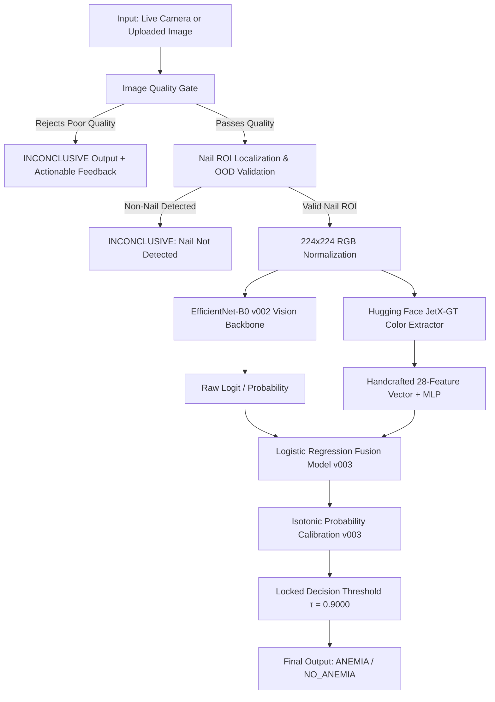

# Anemia AI — Fingernail-Based Anemia Assessment System

[](https://github.com/owner/anemia-ai/actions/workflows/ci.yml)
[](https://github.com/owner/anemia-ai/actions/workflows/tests.yml)
[](https://www.python.org/)
[](https://fastapi.tiangolo.com/)
[](https://pytorch.org/)
[](#important-medical-status--disclaimer)

A production-grade, modular Medical-AI system for non-invasive, point-of-care anemia risk screening from fingernail photographs. Combines deep convolutional vision (**EfficientNet-B0 v002**) with handcrafted chromatic feature modeling (**Hugging Face JetX-GT**), empirical logistic fusion, isotonic probability calibration, and locked sensitivity decision thresholds.

---

> [!CAUTION]
> ### IMPORTANT MEDICAL STATUS & CLINICAL DISCLAIMER
> **Investigational Research Prototype Only**: This software and its associated models are designated strictly for clinical research, observational screening studies, and technology evaluation.
> - **NOT A STANDALONE DIAGNOSTIC DEVICE**: This system has not been cleared or approved by the US FDA, CE Mark authorities, or other national medical device regulatory authorities.
> - **MANDATORY CLINICAL CONFIRMATION**: All outputs are **model-estimated probabilities** intended to assist triaging. Confirmatory clinical laboratory evaluation (Complete Blood Count / automated hemoglobin measurement) and physician consultation are mandatory before making any medical diagnostic or therapeutic decisions.

---

## Key Features

- 📷 **Dual Input Modalities**: Seamless support for live phone camera captures (with viewfinder reticle) and high-resolution image uploads (JPEG, PNG, WebP).
- 🛡️ **Medical Image Quality Gate**: Pre-inference filtering for optical blur (Laplacian variance), illumination extremes (underexposure/overexposure), specular glare, and artificial nail polish.
- 🔬 **Anatomical Nail ROI Localization**: Automatic subungual nail bed segmentation with chromatic YCrCb thresholding and out-of-distribution (OOD) non-nail surface rejection.
- ⚡ **Two-Model Ensemble Pipeline (`ensemble_v003`)**:
  - **Primary**: Deep transfer-learning EfficientNet-B0 (`v002`).
  - **Secondary**: Hugging Face `JetX-GT/nail-anemia-detector` (27/28 color/texture features + MLP).
  - **Fusion**: Empirical logistic regression with non-parametric Isotonic Regression probability calibration.
- 🔒 **Locked Decision Threshold**: Calibrated threshold (&tau;=0.9000) derived on held-out validation data targeting &ge;90% clinical screening sensitivity.
- 📊 **Transparent Pipeline Diagnostics**: Live intermediate telemetry exposing raw vision logits, color probabilities, fusion scores, and component latencies.
- 👥 **Multi-Nail Aggregation**: Evaluates 2 to 4 nail photographs per subject using mean calibrated risk aggregation.
- 🚀 **Production Architecture**: Decoupled Python package (`src/anemia_ai`), typed Pydantic schemas, structured logging, Docker containerization, and comprehensive automated test suite.

---

## Architecture



---

## Repository Structure

```
MYPASS/
├── README.md                          <- Project overview & quickstart
├── LICENSE                            <- License terms (Owner confirmation required)
├── CHANGELOG.md                       <- Baseline version changelog
├── CONTRIBUTING.md                    <- Contribution and coding standards
├── SECURITY.md                        <- Vulnerability and patient privacy policy
├── pyproject.toml                     <- Packaging & tool configurations
├── Makefile                           <- Developer workflow shortcuts
├── Dockerfile                         <- Production container build
├── docker-compose.yml                 <- Multi-container orchestration
├── .gitignore                         <- Excludes PHI, patient datasets, secrets
├── .gitattributes                     <- Line ending normalization
│
├── src/anemia_ai/                     <- Modular Application Source
│   ├── config/                        <- Settings, constants, and environment loader
│   ├── core/                          <- Base interfaces, logging, exception hierarchy
│   ├── schemas/                       <- Pydantic request and response contracts
│   ├── preprocessing/                 <- Quality gates, ROI detection, feature extraction
│   ├── models/                        <- BaseModel, EfficientNetB0, JetX, Registry
│   ├── calibration/                   <- Probability calibration & reliability metrics
│   ├── inference/                     <- Single & ensemble inference services
│   ├── services/                      <- Application orchestrator
│   ├── api/                           <- FastAPI app, routes (/api/v1/...), middleware
│   ├── training/                      <- Reproducible training engine & datasets
│   ├── evaluation/                    <- Diagnostic metrics and leakage auditors
│   └── utils/                         <- Hashing, timing, and image helpers
│
├── backend/                           <- Backward-compatibility facades
├── frontend/                          <- Mobile Web Interface (HTML, CSS, JS)
├── configs/                           <- Runtime and training configurations
├── models/manifests/                  <- Checkpoint manifests with SHA256 hashes
├── scripts/                           <- CLI entry points (train, evaluate, verify, quality)
├── tests/                             <- Unit, API, Inference, and Training test suites
├── docs/                              <- System architecture, Model Card, Clinical validation
└── unnecessary/                       <- Archived historical scripts and debug logs
```

---

## Requirements & Prerequisites

- **Operating System**: Linux, macOS, or Windows 10/11.
- **Python**: Version `3.9`, `3.10`, `3.11`, `3.12`, or `3.13`.
- **GPU Hardware**: (Optional for inference, recommended for training) NVIDIA GPU with CUDA 12.0+ (e.g. RTX 3070 / A100 / T4).

---

## Quickstart & Installation

### 1. Clone & Set Up Environment

```bash
git clone <repository_url>
cd MYPASS

python -m venv .venv
# Activate environment:
# Windows (PowerShell):
.venv\Scripts\Activate.ps1
# Linux / macOS:
source .venv/bin/activate
```

### 2. Install Package

```bash
# Production install:
pip install -e .

# Development install (includes pytest, ruff, mypy):
pip install -e ".[dev]"
```

### 3. Synchronize External Models

```bash
python scripts/download_models.py
```

### 4. Verify System Environment

```bash
python scripts/verify_environment.py
```

---

## Running the Application

### Start Local Server

```bash
uvicorn anemia_ai.api.app:app --host 0.0.0.0 --port 8000 --reload
```

- **Web Frontend**: Navigate to `http://localhost:8000/`
- **Interactive Swagger API Docs**: `http://localhost:8000/docs`
- **ReDoc API Docs**: `http://localhost:8000/redoc`

### Docker Execution

```bash
docker compose up -d
```

---

## Automated Testing & Quality Gates

Run all unit, API, model smoke, and integration tests:

```bash
# Using standard test runner:
python -m unittest discover -s tests -p "test_*.py"

# Or run complete quality gates:
python scripts/run_quality_checks.py
```

The quality gate automatically validates:
1. **Secret & Privacy Gate**: Confirms zero API keys, passwords, or patient PHI in repository files.
2. **Checkpoint Integrity Gate**: Validates SHA256 checksums of model weights.
3. **Automated Test Suite**: Executes 43+ comprehensive tests across all modules.

---

## Reproducible Model Training

Training is fully configured through declarative configuration files:

```bash
python scripts/train.py --config configs/training/efficientnet_b0_v002.yaml
```

To fit the dual-model ensemble fusion and isotonic calibrator:

```bash
python scripts/train_ensemble_v003.py
```

---

## Clinical Data Protection & Privacy Policy

> [!IMPORTANT]
> **Zero Patient Identifiers in Version Control**:
> - Clinical patient photographs, medical record numbers, and raw hospital datasets are strictly excluded via `.gitignore`.
> - All software tests utilize **synthetic test fixtures** (`tests/fixtures/synthetic_samples.py`).
> - Data splits (`data/splits/`) are partitioned strictly at the patient identifier level to guarantee zero patient overlap.

---

## License & Ownership

[OWNER CONFIRMATION REQUIRED]  
Copyright &copy; 2026 Anemia AI Research & Development Team. All rights reserved. Designated as an investigational research prototype. Refer to [`LICENSE`](file:///c:/Users/Asus/MYPASS/LICENSE) for terms.
